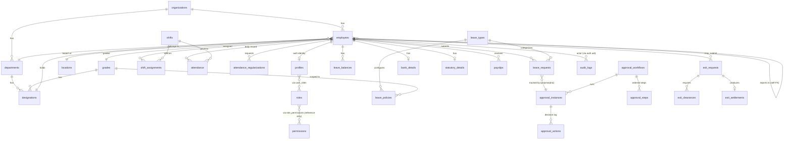

# Wallet HR — Database Documentation

PostgreSQL schema for Wallet HR, built incrementally on Supabase (Postgres +
Auth + Storage + Row Level Security) across `supabase/migrations/0001` through
`0030`. This document is the full reference: table inventory, naming
deviations from a literal spec reading, the RLS access model, audit-trail
coverage, data masking, and the soft-delete stance. `README.md`'s "Database &
RLS" section has the short version; this is the long one.

Single source of truth is the individual migration files in
`supabase/migrations/`, applied in filename order. `supabase/full_setup.generated.sql`
is the same content concatenated (migrations + `supabase/seed/seed.sql`) for a
one-paste setup — regenerate it by hand if you edit a migration after the fact
(every migration so far has been append-only; none has been edited post-merge).

---

## 1. Table inventory

Grouped by module, matching the app's own module boundaries. For each table:
purpose, and the migration that created it (later migrations that extended it
are noted).

### Core

| Table | Purpose | Migration |
|---|---|---|
| `organizations` | Multi-tenant root. One row is seeded; every other table carries `organization_id` so a second tenant could onboard without a schema change. | `0002` |
| `profiles` | Extends `auth.users` with app-level identity (`organization_id`, `email`, `phone`, `is_active`, `last_login_at`). This is the spec's "users" table — see [§2](#2-naming-deviations-from-a-literal-spec-reading). | `0003` |
| `roles` | Fixed 4-row catalog: `employee`, `manager`, `hr_admin`, `super_admin`. Not freely extensible — hardcoded via a `check` constraint. | `0003` |
| `permissions` / `role_permissions` | A granular resource-action permission catalog + role↔permission junction. Seeded in `0030` as **reference/documentation data** — see [§6](#6-permissions--role_permissions-reference-data-not-an-engine). | `0003` (schema), `0030` (seed) |
| `user_roles` | Which `auth.users` row holds which `roles` row, per organization. An employee can hold multiple roles (e.g. `employee` + `manager`). | `0003` |

### Employee

| Table | Purpose | Migration |
|---|---|---|
| `employees` | The core employee record: identity, employment dates/type/status, and FKs to department/designation/location/grade/reporting-manager. | `0005` |
| `employee_profiles` | Extended personal fields kept off the core row (marital status, address, emergency contact, ...). | `0005` |
| `departments` | Reference table. `head_employee_id` added in `0029`. | `0002` (`0029` for head) |
| `designations` | Reference table. `code`, `grade_id`, `department_id` added in `0029`. | `0002` (`0029` for extras) |
| `locations` | Reference table. `time_zone` added in `0029`. | `0002` (`0029` for time_zone) |
| `grades` | Reference table with a numeric `rank` (used for pay-scaling in seed data). | `0002` |
| `shifts` | Shift definition (start/end time, grace, half/full-day hours) **plus** attendance-rule columns added in `0029` — see [§2](#2-naming-deviations-from-a-literal-spec-reading) for why there's no separate `attendance_rules` table. | `0004` (`0029` for rules) |
| `shift_assignments` | Which shift an employee is on, over a date range. | `0005` |

("managers" is not a table — see §2.)

### Attendance

| Table | Purpose | Migration |
|---|---|---|
| `attendance` | One row per employee per day: computed check-in/out, effective/late/early/excess/shortfall minutes, day status. | `0006` |
| `attendance_punches` | Raw device/mobile/web punches before they're collapsed into `attendance`. | `0006` |
| `attendance_regularizations` | Employee-submitted correction request against a day's `attendance` row. | `0006` |

("attendance_rules" is not a table — see §2.)

### Leave

| Table | Purpose | Migration |
|---|---|---|
| `leave_types` | Catalog: code, name, paid/unpaid, accrual frequency, half-day/attachment rules. | `0007` |
| `leave_policies` | The actual entitlement config (annual entitlement, carry-forward limit, encashment) per leave type, optionally scoped to a grade, with an effective date range. | `0007` |
| `leave_balances` | Per-employee, per-leave-type, per-period ledger (opening/credited/used/balance). | `0007` |
| `leave_requests` | Employee leave applications. | `0007` |

### Permission

| Table | Purpose | Migration |
|---|---|---|
| `permission_requests` | Short-duration (hours, not days) time-off requests. | `0008` |

(`onduty_requests` and `other_requests` also live here structurally — extra categories added in `0008`/`0028` beyond the original spec list, following the same request-table shape.)

### Holiday

| Table | Purpose | Migration |
|---|---|---|
| `holidays` | Org-wide or location-scoped (`location_id` nullable) holiday calendar. No `is_active` column — deletion is a real DELETE, not a soft toggle (see [§5](#5-soft-delete-stance)). | `0009` |

### EIP (Employee Information Portal)

| Table | Purpose | Migration |
|---|---|---|
| `bank_details` | Employee's current bank payment details. Direct SELECT is HR-only as of `0030` — see [§4](#4-masking). | `0012` |
| `bank_detail_change_requests` | Employee-submitted change, approved by HR before it overwrites `bank_details`. | `0012` |
| `statutory_details` | PAN/Aadhaar/UAN/PF/ESI numbers + tax regime. Direct SELECT is HR-only as of `0030`. | `0012` |
| `family_members` | Self-service family details. | `0011` |
| `education_records` | Self-service academic qualifications. | `0011` |
| `previous_employment` | Self-service prior-employer history (distinct from `previous_employer_declarations`, which is FY-specific income for tax computation). | `0011` |
| `employee_assets` | Company assets issued to an employee. | `0026` |
| `documents` / `employee_documents` | `documents` is the document-*type* catalog (Resume, PAN, ...); `employee_documents` is the actual uploaded file + verification status. | `0010` |
| `payslips` | One row per employee per pay period. Full earnings/deduction breakdown added in `0026`. | `0013` (`0026` for breakdown) |
| `tax_declarations` | Per-financial-year regime choice + declared investments. | `0013` |
| `previous_employer_declarations` | Per-financial-year prior-employer income/TDS for tax computation. | `0026` |
| `policy_documents` | Org-wide policy documents (HR handbook, etc.), grouped by year. This is the spec's "policies" table — see [§2](#2-naming-deviations-from-a-literal-spec-reading). | `0026` |

### Exit

| Table | Purpose | Migration |
|---|---|---|
| `exit_requests` | Resignation record: dates, notice period, status machine (`draft`→`submitted`→`manager_approved`→`hr_approved`→`completed`, or `rejected`/`withdrawn`). | `0014` |
| `exit_interviews` / `exit_interview_responses` | One interview per exit request, employee-self-administered, against a configurable question bank. | `0014` |
| `exit_interview_questions` | The configurable question bank (category, response type, display order). | `0014` |
| `exit_clearances` | Per-department (manager/HR/IT/finance/admin) clearance sign-off. | `0027` |
| `exit_settlements` | Final settlement figures, with `final_settlement_amount` as a `generated always as (...) stored` column. This is the spec's "final_settlements" table — see [§2](#2-naming-deviations-from-a-literal-spec-reading). | `0027` |

### Workflow

| Table | Purpose | Migration |
|---|---|---|
| `approval_workflows` | Named, ordered approval chain definition per `request_type` (7 types, including `other_request` added in `0028`). | `0015` |
| `approval_steps` | Ordered steps within a workflow: approver type (reporting manager / role / specific employee), `is_final`, and `escalate_after_hours` (added `0029` — **captured but not enforced**, see [§3](#3-audit-trail-coverage)). | `0015` (`0029` for escalation column) |
| `approval_instances` | The live run of one workflow against one concrete request (polymorphic via `request_type`+`request_id`). This is the spec's "approval_requests" table — see [§2](#2-naming-deviations-from-a-literal-spec-reading). | `0015` |
| `approval_actions` | One row per approve/reject/delegate decision made against an instance. | `0015` |

The actual runtime status-flip for leave/permission/regularization/on-duty/other
requests goes through `act_on_approval()` (`0025`, extended `0028`), a
SECURITY DEFINER RPC — **not** direct client writes to these tables. It is
currently hardcoded single-step (always writes `current_step_order = 1` and
never reads `approval_steps` to route between steps) — multi-step sequencing
and escalation exist as schema but not as enforced runtime behavior yet.

### System

| Table | Purpose | Migration |
|---|---|---|
| `notifications` | In-app notifications, one row per recipient per event. | `0016` |
| `audit_logs` | Append-only (no UPDATE/DELETE policy exists at all). See [§3](#3-audit-trail-coverage). | `0016` |
| `system_settings` | Org-wide key/value config (`jsonb` value). Write access requires `super_admin` specifically — stricter than every other table, which only needs `hr_admin`. | `0016` |

---

## 2. Naming deviations from a literal spec reading

Every table from the requested list exists; six map onto something slightly
different, each a deliberate choice made and documented at the time:

| Spec name | Actual implementation | Why |
|---|---|---|
| `users` | `public.profiles`, extending `auth.users` | Supabase already owns the `users` concept in the `auth` schema — shadowing it with a second `public.users` would be confusing and redundant. |
| `policies` | `public.policy_documents` | `policies` alone was judged too generic/collision-prone next to `leave_policies`/`approval_workflows` (which are also "policies" in a loose sense) — `policy_documents` says specifically "uploaded policy files." |
| `final_settlements` | `public.exit_settlements` | Grouped with the rest of the `exit_*` table family for discoverability; "final" is redundant once it's scoped to `exit_`. |
| `approval_requests` | `public.approval_instances` | "Request" was already used by the *source* tables (`leave_requests`, `permission_requests`, ...) that this table polymorphically points *at* — "instance" (an instance of a workflow, running against a request) avoids the name collision. |
| `managers` | `employees.reporting_manager_id` (self-referencing FK) + the `manager` role | A dedicated table would just duplicate the FK — "who is whose manager" is already fully expressed by the FK, and "can approve things" is already fully expressed by holding the `manager` role. |
| `attendance_rules` | Extra columns on `shifts` (`weekoff_days`, `overtime_*`, `late_rule_enabled`, `early_going_rule_enabled`, `shortfall_rule_enabled`, added in `0029`) | The requested rule set (grace period, late rule, early-going rule, overtime rule, shortfall rule, weekoff) is entirely *per-shift* configuration — a standalone table would need a 1:1 FK back to `shifts` anyway, so it's the same data with an extra join. One row per shift, edited from two focused UI screens (Shifts for the base definition, Attendance Rules for these columns). |

---

## 3. Audit trail coverage

The spec requires: *"Every sensitive modification must create an audit
record"* with User/Action/Module/Record ID/Old Data/New Data/Timestamp.
`audit_logs` (`0016`) has exactly these columns (`actor_user_id`, `action`,
`module`, `record_id`, `old_value`, `new_value`, `created_at`), plus
`ip_address` (**never populated by any code path today** — no request-IP
plumbing exists anywhere in the stack, so this column is always `NULL`).

**As of `0030`, coverage is generic-trigger-based**, not hand-maintained per
call site. `public.audit_row_change()` is an `AFTER INSERT OR UPDATE OR
DELETE` trigger that writes one `audit_logs` row per change, with full
before/after row snapshots as `jsonb`. It's attached to:

```
bank_details, statutory_details, employees, employee_profiles,
payslips, tax_declarations, previous_employer_declarations,
leave_requests, permission_requests, attendance_regularizations,
onduty_requests, other_requests,
exit_requests, exit_settlements, exit_clearances,
user_roles, system_settings, employee_documents,
bank_detail_change_requests, leave_balances
```

**Deliberately not attached** to organization-structure/reference tables
(`departments`, `designations`, `locations`, `grades`, `shifts`, `leave_types`,
`leave_policies`, `holidays`, `documents`, `approval_workflows`,
`approval_steps`, `policy_documents`, `exit_interview_questions`,
`employee_assets`, `family_members`, `education_records`,
`previous_employment`) — "sensitive" here means PII, compliance-relevant, or
approval/decision data, not org-chart config. Adding audit coverage to these
too is a one-line addition to the `sensitive_tables` array in `0030` if a
future requirement wants it.

**Storing full snapshots is safe**: `audit_logs` SELECT is `is_hr_or_admin()`-only
(`0021`), the same population that can already read every sensitive source
table directly — the audit trail doesn't expose anything to a wider audience
than already has access.

**Separately, three SECURITY DEFINER RPCs also write `audit_logs`** for
actions that don't correspond to a plain table mutation:
- `get_my_bank_details()` / `get_my_statutory_details()` (`0026`) — insert a
  `'view'`-action row every time an employee reads their own masked data.
- `act_on_approval()` (`0025`, extended `0028`) — inserts an
  `'approval'`/`'rejection'` row (in addition to the generic trigger firing on
  the underlying `leave_requests`/etc. row it updates — so an approval
  decision produces *two* audit rows: one generic `'update'` from the trigger,
  one purpose-built `'approval'`/`'rejection'` from the RPC with the decision
  remarks attached. This is intentional redundancy, not a bug — the trigger
  guarantees baseline coverage even if the RPC is ever bypassed or extended;
  the RPC row carries the human-readable decision context the generic
  before/after diff doesn't).

---

## 4. Masking

The spec: *"Never expose... Full Aadhaar, Full bank account... through
unauthorized queries. Sensitive fields should be masked."*

`get_my_bank_details()` and `get_my_statutory_details()` (`0026`) are
SECURITY DEFINER RPCs that mask before returning:

```sql
overlay(sd.pan_number placing repeat('X', greatest(length(sd.pan_number) - 4, 0))
  from 1 for greatest(length(sd.pan_number) - 4, 0))
```

— i.e. everything except the last 4 characters becomes `X`, applied to
`pan_number`, `aadhaar_number`, and `account_number`. `src/lib/mask.ts`
mirrors the same trailing-4-visible convention client-side for consistency,
but the masking that matters happens server-side, before the value ever
leaves Postgres.

**As of `0030`, this is no longer just a UI convention** — `bank_details_select`
and `statutory_details_select` now read `using (public.is_hr_or_admin())`
only (previously also granted the owning employee direct, unmasked SELECT).
Employees reach their own data exclusively through the two masking RPCs,
which are SECURITY DEFINER and read the raw table directly — unaffected by
this change. HR/admin retain full unmasked table access, since they need it
for legitimate record-keeping and already had it.

Passwords are never a concern here — they live entirely in Supabase-managed
`auth.users`, never mirrored into `public` schema tables.

---

## 5. `created_by` / `updated_by`, and soft delete

**`created_by`/`updated_by`**: present on every table where mutation
provenance matters (~20 tables). As of `0030`, both are auto-populated by DB
triggers — `public.set_created_by()` (BEFORE INSERT, auto-attached to every
table with a `created_by` column via an `information_schema`-driven `DO`
block, so new tables get it automatically) and an extended
`public.set_updated_at()` (BEFORE UPDATE, sets `updated_at` always and
`updated_by` when the column exists). Before `0030`, these columns existed
but were never populated by anything — no trigger, no RPC, no app code — so
every existing row's `created_by`/`updated_by` will be `NULL` until the row
is next updated post-`0030`.

**Soft delete**: no table has a `deleted_at`/`is_deleted` column — genuinely
not needed almost everywhere, because:
- **Reference tables** (`departments`, `designations`, `locations`, `grades`,
  `shifts`, `leave_types`, `holidays`, ...) already have an `is_active` flag
  that the Admin UI uses as the practical "soft delete." Their child FKs
  (e.g. `employees.department_id`) default to `NO ACTION`/`RESTRICT` (no
  `on delete cascade` specified), so a hard DELETE on an in-use reference row
  just fails loudly with an FK-violation error — it can't silently cascade.
- **`employees`** is the one place a hard delete would be genuinely
  dangerous: ~15+ tables reference `employee_id` with `on delete cascade`
  (attendance, leave, payslips, bank details, ...), so deleting an employee
  row would silently wipe their entire history. The Admin UI never calls
  delete on employees — it only flips `employment_status` to `'inactive'`
  (already the intended lifecycle mechanism). As of `0030`, the
  `employees_delete` RLS policy is removed entirely — hard delete is no
  longer possible via any client role, closing a foot-gun with no legitimate
  caller rather than adding a parallel soft-delete column that nothing
  would populate either.

---

## 6. `permissions` / `role_permissions`: reference data, not an engine

These two tables exist in the schema (`0003`) matching the spec's requested
`permissions` table, but were never seeded or queried by anything —
**all real authorization in this app is role-string-based**, via
`has_role(_role_code)` / `is_hr_or_admin()` / `is_manager_of(_employee_id)`
(`0017_rls_helper_functions.sql`), referenced directly in every RLS policy
across every migration.

As of `0030`, `permissions` is seeded with ~30 module-scoped permission codes
(`leave.approve_team`, `payroll.manage`, `system_settings.manage`, ...) and
`role_permissions` maps each of the 4 roles to the codes it can already
exercise per the existing RLS policies. **This is documentation, not
enforcement** — no policy or helper function reads these tables. Rewiring
the app onto a real granular-permission engine (checking `role_permissions`
inside every RLS policy instead of a role-string check) would be a large,
separate undertaking touching every policy in the schema; seeding these
tables closes the "exists but is silently empty and unexplained" gap
cheaply without pretending a rewrite happened.

---

## 7. RLS access model

Every table's RLS policies compose from a small set of helper functions
(`0017_rls_helper_functions.sql`, all `SECURITY DEFINER stable`):

| Function | Resolves |
|---|---|
| `current_employee_id()` | The `employees.id` row for `auth.uid()`. |
| `current_organization_id()` | The caller's `organization_id`. |
| `has_role(_role_code)` | Whether the caller holds a given role (via `user_roles`/`roles`). |
| `is_hr_or_admin()` | `has_role('hr_admin') or has_role('super_admin')`. |
| `is_manager_of(_employee_id)` | Walks `reporting_manager_id` upward (bounded to 12 levels) from `_employee_id` — **transitive**, so a skip-level manager also passes. |
| `request_owner_employee_id(_request_type, _request_id)` | Polymorphic lookup: which employee owns a given approval-engine request. |

The spec's four access levels map onto these directly:

- **Employee — self only**: `employee_id = current_employee_id()`. Applies to viewing/editing one's own profile, requests, EIP records.
- **Manager — direct/indirect reports**: `is_manager_of(employee_id)`, added alongside the self-clause on every request/attendance table. Transitive by design (see above) — Manager Self Service's dashboard aggregates instead use **direct reports only** (`employees.reporting_manager_id = current_employee_id()`), a deliberately narrower scope than the RLS helper, chosen so a senior manager's dashboard doesn't silently include their reports' reports.
- **HR — organization-wide**: `is_hr_or_admin() and organization_id = current_organization_id()`.
- **Admin (`super_admin`)** — everything HR has, plus the one table gated stricter than HR: `system_settings`, which requires `has_role('super_admin')` specifically on write.

**"Employee cannot modify approved requests"** (a literal spec requirement)
is enforced via `with check` clauses on the 5 request tables' UPDATE policies
as of `0030` (`leave_requests`, `permission_requests`,
`attendance_regularizations`, `onduty_requests`, `other_requests`) —
an employee's own update is only accepted while `status` is still
`draft`/`pending`/`cancelled`; moving a request to `approved`/`rejected`
requires `is_manager_of()` or `is_hr_or_admin()`. `exit_requests` had this
same class of fix earlier, in `0027`, after a specific incident where an
employee could self-approve their own resignation via a raw client update.

---

## 8. Migration index

| # | File | Adds |
|---|---|---|
| 0001 | `extensions_and_helpers` | `pgcrypto`, `set_updated_at()` |
| 0002 | `core_reference_tables` | organizations, locations, departments, designations, grades |
| 0003 | `roles_permissions_profiles` | profiles, roles, permissions, role_permissions, user_roles |
| 0004 | `shifts` | shifts |
| 0005 | `employees` | employees, employee_profiles, shift_assignments |
| 0006 | `attendance` | attendance, attendance_punches, attendance_regularizations |
| 0007 | `leave` | leave_types, leave_policies, leave_balances, leave_requests |
| 0008 | `permission_onduty` | permission_requests, onduty_requests |
| 0009 | `holidays` | holidays |
| 0010 | `documents` | documents, employee_documents |
| 0011 | `family_education_employment` | family_members, education_records, previous_employment |
| 0012 | `bank_statutory` | bank_details, bank_detail_change_requests, statutory_details |
| 0013 | `payroll` | payslips, tax_declarations |
| 0014 | `exit` | exit_requests, exit_interviews, exit_interview_responses, exit_interview_questions |
| 0015 | `approval_engine` | approval_workflows, approval_steps, approval_instances, approval_actions |
| 0016 | `notifications_audit_settings` | notifications, audit_logs, system_settings |
| 0017 | `rls_helper_functions` | `current_employee_id()`, `is_manager_of()`, `is_hr_or_admin()`, ... |
| 0018 | `rls_org_and_reference_data` | RLS for reference tables |
| 0019 | `rls_employees_and_requests` | RLS for employees + request tables |
| 0020 | `rls_sensitive_and_payroll` | RLS for bank/statutory/payslips/exit |
| 0021 | `rls_approvals_notifications_audit` | RLS for approval engine, notifications, audit_logs |
| 0022 | `storage_buckets` | employee-documents, employee-photos buckets + policies |
| 0023 | `login_lookup_rpc` | `resolve_login_email()` |
| 0024 | `employees_can_view_own_manager` | RLS patch |
| 0025 | `approval_action_rpc` | `act_on_approval()` (3-arm) |
| 0026 | `eip_extras` | employee_assets, policy_documents, previous_employer_declarations, payslip breakdown, `get_my_bank_details()`, `get_my_statutory_details()` |
| 0027 | `exit_extras` | exit_clearances, exit_settlements, `act_on_exit_request()`, `act_on_exit_clearance()`, `get_hr_contact()`, `exit_requests_update` RLS fix |
| 0028 | `mss_other_requests_and_approvals` | other_requests, `act_on_approval()` extended to 5 arms + audit_logs insert |
| 0029 | `admin_module_extras` | department head, designation code/grade/department, location time_zone, shift rule columns, approval_steps escalation column |
| 0030 | `data_governance_hardening` | This document's §3–§7 fixes: request-approval RLS lock, bank/statutory RLS tightening, employee hard-delete removal, `created_by`/`updated_by` triggers, generic audit trigger, permissions/role_permissions seed |
| 0031–0043 | *(not yet indexed here)* | Leave/permission overlap guards, regularization/exit duplicate guards, FK index coverage, WFH + leave attendance sync, permission balance, missing attendance report (+ ambiguous-column fix), notifications HR-read bypass, monthly leave balance periods, cumulative leave balance deduction. See the individual migration files' header comments for full detail. |
| 0044 | `effective_hours_engine` | `attendance.gross_minutes`/`break_minutes`/`missing_in`/`missing_out`, `shifts.standard_break_minutes`, `recompute_attendance_day()` (the centralized multi-session effective-hours engine -- sums every valid in/out session from `attendance_punches` instead of a single check_out - check_in pair), `act_on_approval()`'s regularization branch rewritten to feed it via synthetic punches, `get_missing_attendance()` fixed to read the stored missing_in/missing_out flags (was flagging approved WFH/On-Duty days as missing punches) |
| 0045 | `configurable_break_policy` | `shifts.min_break_minutes`/`max_break_minutes`/`break_paid`/`break_deduction_mode`, `attendance.payable_minutes`/`has_excess_break`, `recompute_attendance_day()` reworked so a gap between sessions is classified against the shift's break policy instead of "every gap is a break" -- too-short gaps bridge back into effective time, qualifying gaps deduct as measured or as a flat standard duration (per `break_deduction_mode`), an unusually long gap is flagged (`has_excess_break`) rather than silently absorbed, and a paid break still counts toward required-hours satisfaction via `payable_minutes` |
| 0046 | `fix_gross_duration_duplicate_out` | Real bug found while building `src/lib/attendanceCalc.ts`'s `evaluateAttendanceDay()` test suite: `gross_minutes` used the raw last OUT punch seen, so a spurious duplicate OUT after a session was already closed silently inflated gross/effective minutes. Fixed to use the last punch that actually closed a session; `check_in`/`check_out` display values are unchanged (still show the raw last punch) |
| 0047 | `email_notification_engine` | `email_templates`, `email_delivery_logs`, `render_email_template()`, `queue_templated_email()` (the one reusable notification service every module queues through), a generic `trg_queue_approval_request_email()` trigger attached to all five request tables (fires 'approval_request' on submission), and `act_on_approval()` extended to queue 'approval_approved'/'approval_rejected'. Actual SMTP delivery is `supabase/functions/process-email-queue/` (not deployed/tested from this session) |
| 0048 | `hr_admin_compliance_modules` | `audit_logs.actor_role`/`employee_id`/`result` (+ `audit_row_change()` updated to populate them, and the sensitive-tables trigger list extended to cover every table added since 0030); `biometric_readers` + `biometric_sync_logs` + `record_biometric_sync_event()`; `email_configuration` with the SMTP password encrypted at rest (pgcrypto, key from `app.settings.smtp_encryption_key`) via `set_email_configuration()`, decryptable only by `get_smtp_credentials()` which is granted exclusively to `service_role`; `attendance_reconciliation_findings` + `run_attendance_reconciliation()` (Biometric vs Leave/WFH/On-Duty/Holiday/Weekoff mismatch detection, safe to re-run). Actual reader/SMTP network actions are `supabase/functions/biometric-reader-action/` and `supabase/functions/test-email-connection/` (neither deployed/tested from this session) |
| 0049 | `monthly_attendance_analysis` | `get_monthly_attendance_summary()` -- one row per self/manager/HR-scoped employee for a given month, aggregating already-computed `attendance` columns (effective/late/early/missing/shortfall/excess-stay all come from `recompute_attendance_day()`, never recomputed here). Mirrors `src/lib/monthlyAnalysisEngine.ts`'s `aggregateMonthlyAttendance()`. Comp-Off Earned/Used always return 0 -- Comp-Off doesn't exist as a feature yet |
| 0050 | `fix_audit_trigger_non_id_primary_key` | Real bug found applying the full migration set live for the first time: `audit_row_change()` (0030) hardcoded `old.id`/`new.id`, which errors outright on any table whose PK isn't literally `id` (`employee_profiles`, PK `employee_id`) -- broken since 0030, never exercised end-to-end before. Fixed to read `id` out of the already-computed row jsonb (returns null for a missing key instead of erroring) |
| 0051 | `fix_audit_trigger_org_resolution` | Same live run, second bug: 11 tables have no `organization_id` column, and the only fallback (`current_organization_id()`, session-based) is null for any action taken outside an authenticated session (seed data, migrations) -- `audit_logs.organization_id` is NOT NULL, so this aborted the *entire triggering transaction*, a logging side-effect blocking real work. Fixed with a 3-tier resolution (row's own column -> via `employee_id` -> session), and the trigger now skips logging (not the transaction) if all three still come up empty |
| 0052 | `fix_queue_templated_email_org_resolution` | Same bug class in `queue_templated_email()` (0047): always resolved org via session, even when called from `trg_queue_approval_request_email()` (a plain INSERT trigger, no session). Added an optional `_organization_id` parameter callers that already know it can pass explicitly; direct client calls still default to session-based resolution |
| 0053 | `act_on_approval_pass_org_explicitly` | Consistency follow-up (not a live bug today, since `act_on_approval()` always runs in a real session) -- passes its own already-resolved `_org_id` into `queue_templated_email()` explicitly, closing the same gap 0050-0052 fixed elsewhere before it can ever bite in a future non-interactive context |
| 0054 | `smtp_password_via_vault` | Real design flaw found trying to complete 0048's own documented setup step: `ALTER DATABASE ... SET app.settings.smtp_encryption_key` fails with "permission denied" for the `postgres` role on Supabase's managed platform (confirmed live, `ALTER ROLE` too) -- customers can't set arbitrary custom GUC parameters at that level. Rebuilt `email_configuration`'s password storage on `supabase_vault` (enabled on this project, standard on every Supabase project) instead of pgcrypto + a custom key -- `password_encrypted` (bytea) replaced by `password_secret_id` (a `vault.secrets` id); `get_smtp_credentials()` now reads `vault.decrypted_secrets`, still `service_role`-only. No manual setup step needed at all now -- verified live: created a probe secret via `vault.create_secret()`, read it back via `vault.decrypted_secrets`, confirmed exact round-trip, deleted the probe |

| 0055 | `fix_audit_role_priority_code` | Real bug found while creating login credentials: `audit_row_change()`'s role-priority ordering compared `roles.name` (display strings, e.g. `'Super Administrator'`) against slugs like `'super_admin'`, which never matched -- the frontend actually reads `roles.code` (`src/auth/AuthProvider.tsx`). Fixed to order on `r.code` |
| 0056 | `grant_base_table_privileges` | The single most consequential bug found this session, caught only by actually logging into the running app for the first time: every one of the schema's 58 public tables was missing base `SELECT`/`INSERT`/`UPDATE`/`DELETE` grants for `anon`/`authenticated`/`service_role` entirely -- only `REFERENCES`/`TRIGGER`/`TRUNCATE` existed (confirmed via `information_schema.role_table_grants`). PostgREST/RLS only ever filters rows *after* Postgres's coarser table-level GRANT already permits the operation, so every RLS policy this project has ever written (0018 onward) was completely unreachable -- every first real query after login failed with `42501 permission denied for table employees`. Root cause: Supabase's platform-level default privileges (confirmed via `pg_default_acl`) only auto-grant full CRUD to `anon`/`authenticated`/`service_role` for tables *created by the `supabase_admin` role*; every table here was created by `postgres` (every migration in this project runs as `postgres`), whose own default ACL for `public` only included `REFERENCES`/`TRIGGER`/`TRUNCATE`. Fixed by granting the missing privileges on every existing table, and by setting `ALTER DEFAULT PRIVILEGES` for future `postgres`-created tables so no future migration has to repeat this |

| 0057 | `web_checkin` | Employee self-service web check-in/out for Work From Home days -- reuses the existing `source='web'` value on `attendance_punches` (0006) and the centralized `recompute_attendance_day()` engine rather than adding a second calculation path. Adds `employees.web_checkin_enabled` (per-employee, HR-toggleable from the Employees admin screen, same pattern as Biometric Readers' enable/disable), `get_web_checkin_status()` (read: access + today's WFH/punch state in one round trip) and `web_checkin_punch(_punch_type)` (write: re-validates access + WFH-day eligibility + in/out alternation server-side, inserts the punch, then calls `recompute_attendance_day()`). Also fixes a guard in `recompute_attendance_day()` (0044-0046) that would have silently swallowed every web punch: it skipped recompute entirely for any 'present'/'Work From Home' day whenever `attendance.check_in`/`check_out` were still null -- true for a WFH day with zero punches, but also true on the very first web punch (recompute hasn't run yet to populate those columns), so the punch would never be aggregated. Changed to check for the *existence* of `attendance_punches` rows instead |

| 0058 | `fix_web_checkin_wfh_eligibility` | Real bug found live-testing 0057 for the first time: `get_web_checkin_status()`/`web_checkin_punch()` gated WFH-day eligibility on `day_status = 'present' and remarks = 'Work From Home'`. That breaks the instant an employee actually checks in -- `recompute_attendance_day()` correctly reclassifies the day as `half_day` while effective minutes are still below the half-day threshold (same as any other employee), but `remarks` stays `'Work From Home'` untouched, so the next status check (or the Check Out click itself) saw `day_status='half_day'` and reported "not an approved WFH day," locking the employee out of ever checking out. Fixed by dropping the `day_status` requirement -- `remarks = 'Work From Home'` alone is the stable tag; `day_status` is allowed to move around it as real hours accumulate |

All 58 migrations plus `seed/seed.sql` have been applied and live-verified against a real Supabase project in this session (`recompute_attendance_day()` output, `email_templates`/`email_delivery_logs`, `audit_logs` row counts, and the Vault secret round-trip were all checked directly against the database). 10 real Supabase Auth accounts were also created for the seeded employees (`auth.users`/`auth.identities`, `employees.user_id` linked, `user_roles` assigned) and login was verified against the real Auth REST API, including a negative test (wrong password correctly rejected). The app was then actually run end-to-end (dev server + headless Chromium): after applying migration 0056, every new module -- Monthly Analysis, Biometric Readers, Email Configuration, Email Templates (including interactive Preview), Attendance Reconciliation (including a live "Run Reconciliation" scan), and Audit Logs -- rendered correctly against real seeded data with zero console errors. Driving the Email Templates Preview also caught a second, unrelated seed-data bug: `seed.sql`'s `email_templates.body` values used plain `'...'` string literals, so under Postgres's default `standard_conforming_strings=on` the literal two-character sequence `\n` was stored instead of a real newline. Fixed in `seed.sql` (changed to `E'...'` escape-string literals) and corrected live on the already-seeded rows; re-verified via a fresh Preview screenshot showing real line breaks.

---

## 9. Entity relationship overview

A simplified view of the core chains — not every FK (there are hundreds),
just the shape that matters for understanding how the modules connect.


